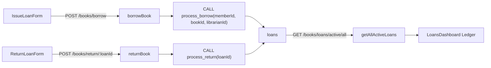

## Unified Loans Dashboard Refactor Plan

### 1. Backend: Active Loans Endpoint

- **Add controller for all active loans**: In `[be/src/controllers/bookController.ts](be/src/controllers/bookController.ts)`, create a new `getAllActiveLoans` handler that:
  - Executes a MySQL query or stored procedure to fetch all loans where `return_date IS NULL`, joining `loans`, `books`, and `members` to return fields like `loan_id`, member full name, book title, and due date (formatted as `YYYY-MM-DD`).
  - Returns data as `{ status: 'success', data: rows }` matching existing controller patterns.
- **Wire route**: In `[be/src/routes/bookRoutes.ts](be/src/routes/bookRoutes.ts)`, import `getAllActiveLoans` and add a protected route, e.g. `router.get('/loans/active/all', verifyToken, getAllActiveLoans);`.
- **Confirm stored procedures**: Ensure existing `process_borrow` and `process_return` procedures continue to be used by `borrowBook` and `returnBook` without changes; the new endpoint should read from the `loans` table only.

### 2. Frontend: New Loans Dashboard Page

- **Create unified page component**: In `[fe/src/pages/LoansDashboard.tsx](fe/src/pages/LoansDashboard.tsx)` (new file), build a `LoansDashboard` component that:
  - Uses `useState`/`useEffect` to load active loans from `GET /books/loans/active/all` via the shared `api` client, storing them in `activeLoans` state.
  - Tracks `loading`, `error`, and `success` messages in a shared notification area.
- **Layout structure (within AdminLayout main content)**:
  - Use a top-level container with CSS Grid or Flexbox to create **two main columns**: a wide middle column for the ledger and a narrower right column for forms, assuming `AdminLayout` already renders the sidebar on the left.
  - **Middle column (Active Ledger)**:
    - Render a table or styled list of all active loans with columns: Member Name, Book Title, Due Date, and an optional "Quick Return" button.
    - Determine overdue status by comparing `due_date` with `new Date()` and apply red text/background for overdue rows.
  - **Right column (stacked forms)**:
    - **Top: Issue a Loan**: Port the existing member and book search UI and `handleBorrow` logic from `BorrowBook.tsx`, slimming styles for a condensed card.
    - **Bottom: Process Return**:
      - Provide a search input that filters `activeLoans` by Loan ID or Book Title (client-side filter over the same `activeLoans` dataset).
      - Show a small list/table with matching rows, each having a **Return** button.
- **Shared return action**:
  - Implement a single `handleReturn(loanId, bookTitle)` that calls `POST /books/return/:loanId` (with admin token), mirroring the logic in `ReturnBook.tsx` but scoped to the new dashboard.
  - Reuse this handler both from the middle ledger quick-return buttons and from the filtered results in the bottom-right section.

### 3. State & Reactive Updates

- **State consolidation**:
  - Centralize `activeLoans`, `loadingActive`, and `activeError` state in `LoansDashboard` so both the ledger and quick-return search share the same data.
  - Maintain separate UI state for the issue form (`memberQuery`, `memberResults`, `selectedMember`, `bookQuery`, `bookResults`, `selectedBook`, `borrowLoading`) and for the quick-return search input and currently processing loan ID.
- **Reactive refresh behavior**:
  - After a successful borrow in the top-right form:
    - Show a success message and reset the issue form inputs, then call `fetchActiveLoans()` to refresh the ledger.
  - After a successful return from any quick-return action:
    - Update UI optimistically by removing the loan from `activeLoans` state, and/or call `fetchActiveLoans()` again to stay source-of-truth aligned.
  - Ensure errors from borrow/return actions are surfaced without breaking the main ledger (e.g., keep ledger data while showing inline error banners).

### 4. Routing & Navigation Adjustments

- **Add new route**: In `[fe/src/App.tsx](fe/src/App.tsx)`:
  - Import `LoansDashboard`.
  - Under the protected admin routes inside `AdminLayout`, add `Route path="/admin/loans" element={<LoansDashboard />} />`.
- **Deprecate old routes (keep components for now)**:
  - Remove or comment out the `/admin/borrow` and `/admin/return` routes from `App.tsx` once `/admin/loans` is verified.
  - Leave `BorrowBook.tsx` and `ReturnBook.tsx` in the codebase temporarily in case we need them for regression comparison, or mark them with a TODO for later removal.
- **Update sidebar navigation**: In `[fe/src/components/AdminSidebar.tsx](fe/src/components/AdminSidebar.tsx)`:
  - Replace the existing link pointing to `/admin/borrow` with `/admin/loans`, updating its label to something like "Loans" or "Circulation".

### 5. Styling & UX Polish

- **Consistent admin look-and-feel**:
  - Reuse typography, buttons, and card styles from existing admin pages like `[fe/src/pages/AdminDashboard.tsx](fe/src/pages/AdminDashboard.tsx)` and `[fe/src/pages/ManageMembers.tsx](fe/src/pages/ManageMembers.tsx)` for visual consistency.
  - Make the right column narrower (e.g., 35–40% width) and stack the two forms with a small gap.
- **Overdue highlighting**:
  - In the active ledger, apply a distinct red text color to the Due Date and/or row background when the loan is overdue, matching the red palette already used for errors (`#dc2626`, `#fef2f2`).
- **Accessibility & feedback**:
  - Use disabled states and clear button labels for processing actions (e.g., "Issuing...", "Returning...").
  - Ensure keyboard navigation for search result lists and forms remains functional, following patterns from `BorrowBook.tsx` and `ReturnBook.tsx`.

### 6. Verification & Cleanup

- **Manual test flows**:
  - Log in as a librarian, navigate to `/admin/loans`, and verify:
    - The active ledger loads with current loans (or a clear empty state).
    - Issuing a loan updates the ledger without a full page reload.
    - Processing a return from both the middle ledger and the bottom-right quick-search removes the loan from the ledger.
    - Overdue loans render with red highlights.
- **Finalize routing cleanup**:
  - After confirming behavior, fully remove the `/admin/borrow` and `/admin/return` routes from `App.tsx` and ensure the sidebar has only the `/admin/loans` entry.
  - Optionally, add a brief comment or TODO near `BorrowBook.tsx` and `ReturnBook.tsx` indicating they are candidates for deletion once no longer needed.

